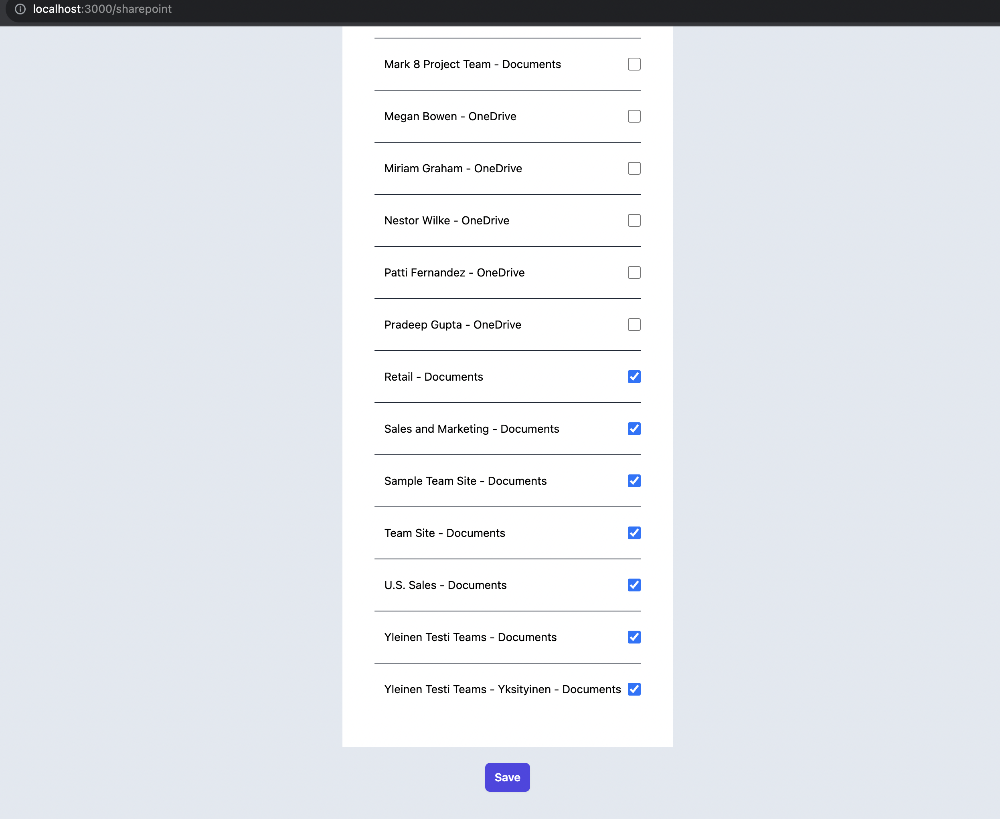
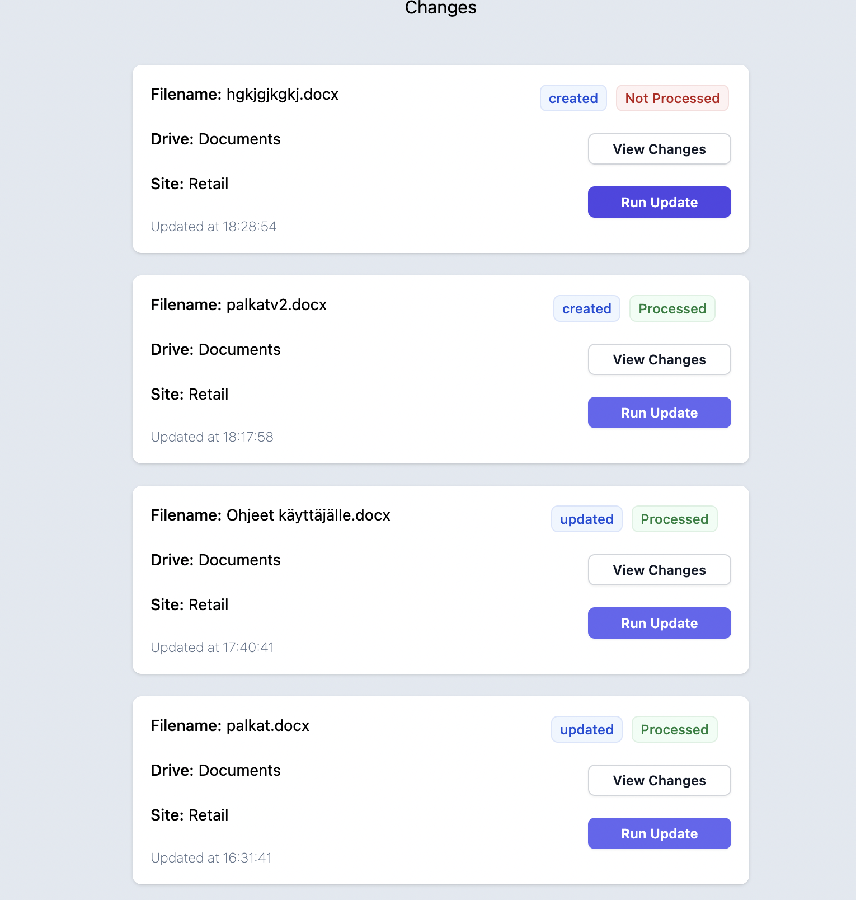
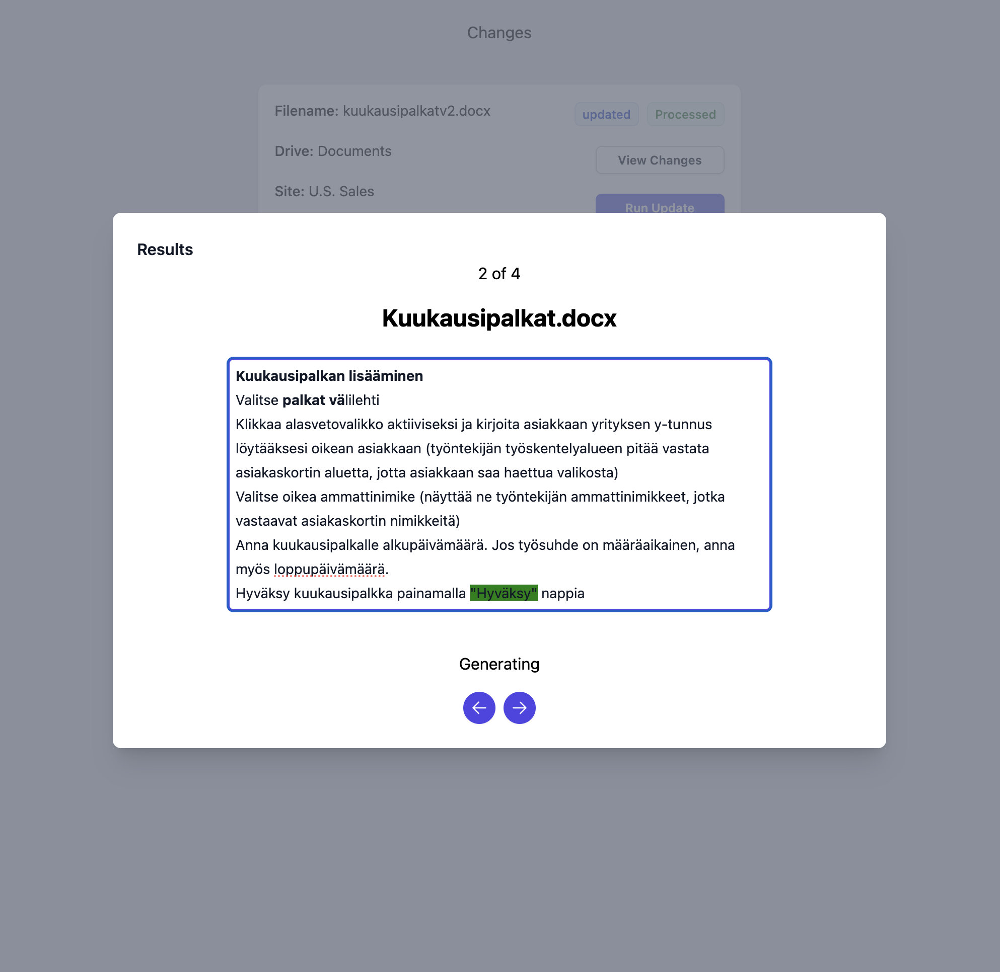

# Document Handler
Raw prototype. Update all sharepoint documents to match an update. All documents that reference old information will get updated. No more outdated infromation in any organization.

Required Env variables described in .env.example

You need to have docker running for the vectordb and ngrok configured with a static address to be able to register webhooks with the microsoft graph api.

Steps to start.
```
pnpm run start-vector-database
pnpm run dev
```

Make sure you have applied migrations before starting (both the qdrant vector database and postgres).

# Example images.

List of all tracked sharepoint sites.



All changes in the tracked sharepoint sites get registered into a changes list



After running an update cycle all proposed chagnges ar shown for proof reading. additions highlighted with green.




